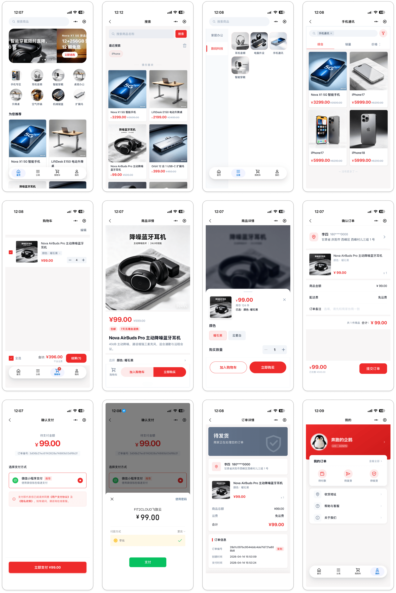

# Halo 商城小程序

基于 [Halo 商城版](https://www.lxware.cn/halo) 的电商小程序，使用 Vue 3 + uni-app 构建，支持微信小程序。

[本地开发指南](./docs/2.prepare-local.md) · [配置说明](./docs/config.md)

## 许可证

本仓库采用自定义 [源码可见许可证](LICENSE) 授权，**不是** OSI 定义下的开源软件。

- 任何人都可以查看源码，并可在非生产环境中用于评估、开发、测试与演示。
- 生产环境使用仅限已合法取得 **Halo 商城版** 授权的客户及其受托开发者。
- 已获授权客户可基于本仓库二次修改，并作为自身项目模板进行编译、部署和使用。
- 未经书面许可，不得将本仓库源码或其修改版本再次分发、转售，或作为可复用模板向第三方提供。

使用前请一并阅读 [许可说明与常见问题](./docs/LEGAL-NOTICE.md)。

## 预览

## 技术栈

- **框架**：Vue 3 + uni-app（组合式 API）
- **状态管理**：Pinia + pinia-plugin-persistedstate
- **样式**：UnoCSS + SCSS
- **HTTP 请求**：Alova + @alova/adapter-uniapp
- **UI 组件**：TDesign uni-app
- **包管理器**：pnpm
