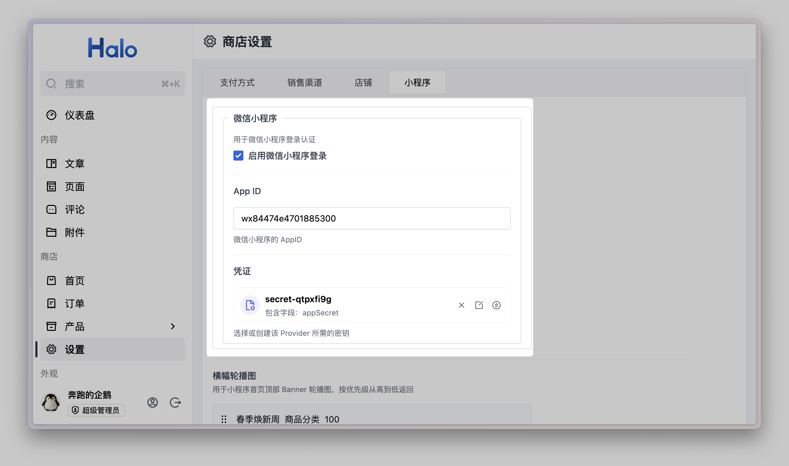
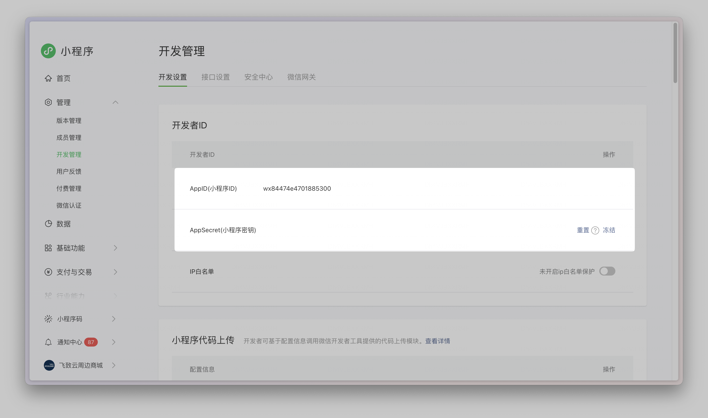
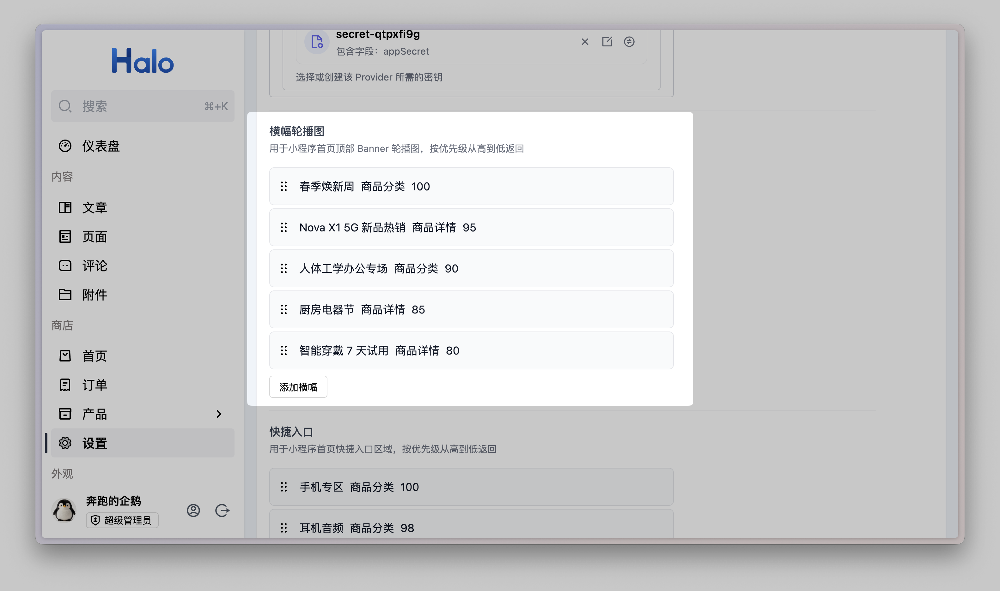
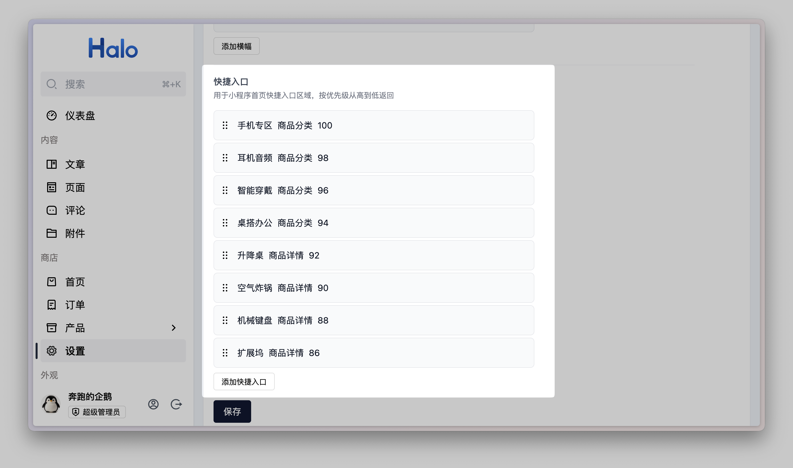
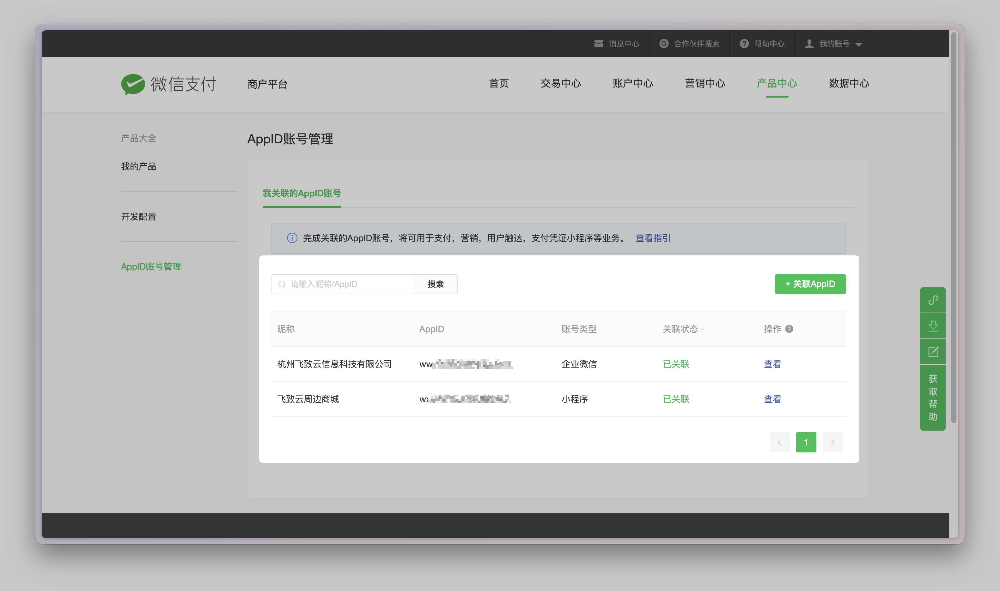
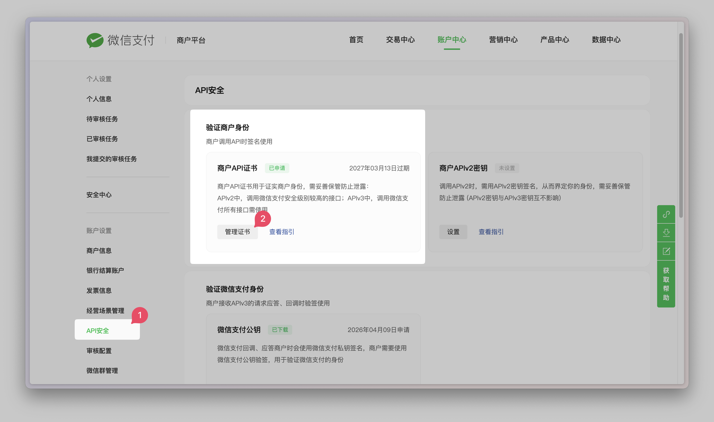
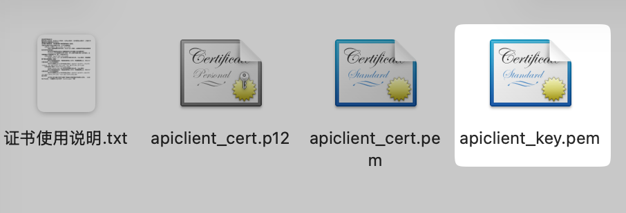
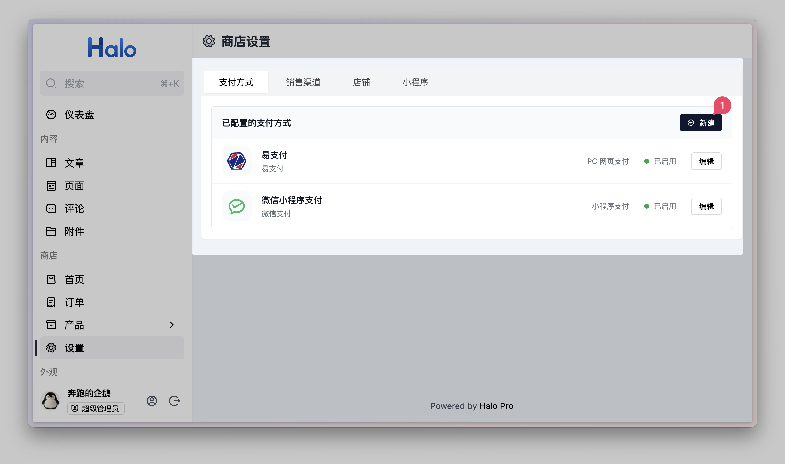
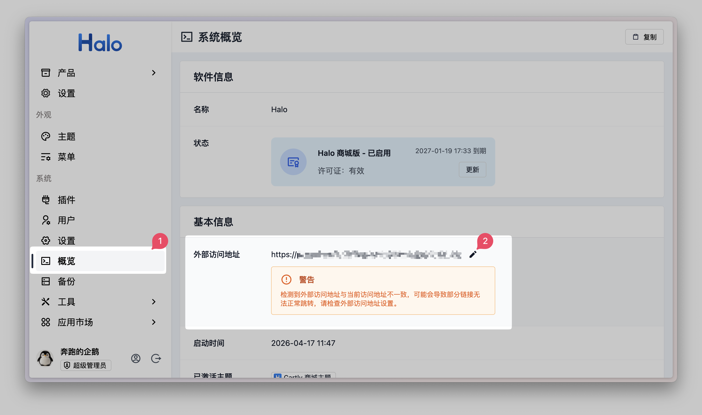
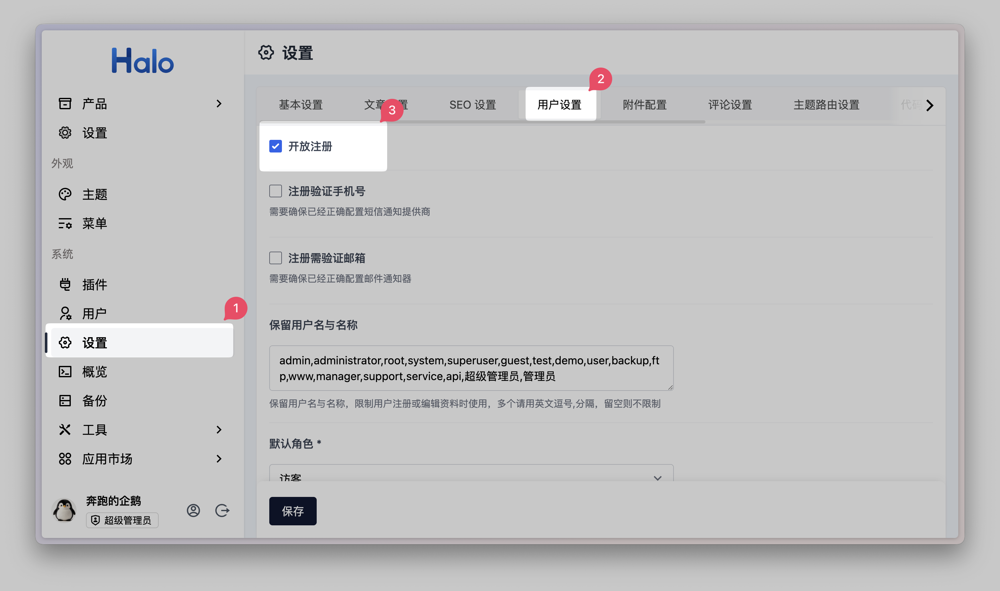

# Halo 后台配置

本文说明在 Halo 管理端完成小程序联调所需的各项配置，包括小程序登录认证、首页内容（轮播图、快捷入口）以及支付方式。

> [!NOTE]
> 本文以联调阶段为背景，目标是让核心流程可以跑通。

---

## 一、小程序设置

小程序设置用于配置微信小程序与 Halo 后台的对接信息，包括登录认证所需的 AppID 与 AppSecret，以及首页展示所需的横幅轮播图与快捷入口内容。这些配置直接影响小程序能否正常登录和首页内容是否丰富。

进入 Halo 管理端，依次点击**商店 → 设置 → 小程序**，完成以下配置。

### 微信小程序登录认证

勾选**启用微信小程序登录**，并填写以下两项凭证：

| 字段   | 说明                                                                                     |
| ------ | ---------------------------------------------------------------------------------------- |
| App ID | 微信小程序 AppID，在[微信公众平台](https://mp.weixin.qq.com) → 开发管理 → 开发设置中获取 |
| 凭证   | 即 `appSecret`，在同一页面获取；                                                         |

> [!WARNING]
> `appSecret` 属于高权限密钥，请勿明文写入配置文件或提交到代码仓库。在 Halo 中通过凭证管理存储可避免泄露风险。

> [!IMPORTANT]
> 此处填写的 **App ID** 必须与前端 `src/manifest.json` 的 `mp-weixin.appid` 字段保持一致，否则登录认证会失败。

---

### 横幅轮播图

在同一页面的**横幅轮播图**区域，点击**添加横幅**，为首页顶部 Banner 配置轮播内容。

每条横幅包含以下字段：

| 字段     | 说明                                                   |
| -------- | ------------------------------------------------------ |
| 标题     | 轮播图文案                                             |
| 副标题   | 轮播图文案描述                                         |
| 图片     | 用于轮播图背景图片展示                                 |
| 跳转类型 | 可选**商品分类**或**商品详情**，决定点击后跳转的目标页 |
| 跳转目标 | 根据跳转类型选择对应的分类或商品                       |
| 优先级   | 数值越大越靠前展示，用于控制轮播顺序                   |

> [!TIP]
> 建议至少添加一条横幅，如果未填写，则小程序端不会展示轮播内容。

---

### 快捷入口

在同一页面继续向下，找到**快捷入口**区域，点击**添加入口**，配置首页的快捷分类入口。

每条快捷入口通常包含：

| 字段     | 说明                                                   |
| -------- | ------------------------------------------------------ |
| 名称     | 快捷入口文案，展示于图标下方                           |
| 图片     | 快捷入口图标图片                                       |
| 跳转目标 | 可选**商品分类**或**商品详情**，决定点击后跳转的目标页 |
| 优先级   | 控制入口排列顺序                                       |

> [!TIP]
> 建议至少添加 4 个快捷入口，如果未填写，则小程序端不会展示快捷入口。

---

## 二、支付方式设置

支付方式设置用于为小程序接入支付能力。完成配置后，用户在小程序内下单时可调起对应的支付方式完成付款。

进入 Halo 管理端，依次点击**商店 → 设置 → 支付方式**进行配置。

### 微信小程序支付

#### 前置：微信侧准备

在 Halo 后台填写支付配置之前，需要先在微信侧完成以下准备：

> [!tip]
>
> 关于微信侧的微信支付对接的详细文档，请查阅 [小程序支付](https://pay.weixin.qq.com/doc/v3/merchant/4015459512)。

**1. 申请微信支付商户号**

前往[微信支付商户平台](https://pay.weixin.qq.com)注册并完成资质审核，获得商户号（mch_id）。已有商户号可跳过此步。

**2.商户号开通 JSAPI 支付权限**

按照微信支付商户平台的[申请JSAPI支付权限指引(小程序支付场景)](https://pay.weixin.qq.com/doc/v3/merchant/4012791895) 文档，申请 JSAPI 支付权限。已申请过 JSAPI 支付权限的商户可跳过此步。

**3. 商户号授权绑定小程序 AppID**

在微信支付商户平台 → **产品中心 → AppID 账号管理**中，将小程序的 AppID 与商户号关联绑定，否则支付请求会因 AppID 与商户号不匹配而失败。

**3. 生成商户 API 证书**

在微信支付商户平台 → **账户中心 → API 安全 → 申请 API 证书**中，使用证书工具生成并下载 API v3 私钥（`.pem` 文件）

可以阅读微信详细指引文档 [获取商户 API 证书](https://kf.qq.com/faq/161222NneAJf161222U7fARv.html) 进行操作。

获取到证书文件夹后，请妥善保管 `apiclient_key.pem` 私钥文件，后续将需要在 Halo 后台上传此私钥文件。

> [!WARNING]
> 私钥文件只能在生成时下载一次，请妥善保管。若丢失，需重新生成。

完成以上步骤后，即可在 Halo 后台填写支付配置。

---

#### 在 Halo 后台填写配置

点击**新建**，或在已有的**微信小程序支付**条目上点击**编辑**，填写以下信息：

| 字段           | 说明                                                                                     |
| -------------- | ---------------------------------------------------------------------------------------- |
| 支付提供商     | 必须选择**微信支付**                                                                     |
| 启用           | 开关打开后该支付方式才会在前端出现                                                       |
| 名称           | 展示给用户的支付方式名称，如「微信小程序支付」                                           |
| 场景           | 必须选择**小程序支付**                                                                   |
| 应用 ID        | 微信小程序 AppID，与登录认证处保持一致，需要与商户号绑定。                               |
| 商户号         | 微信支付商户平台的商户号（mch_id），需要与应用 ID 绑定。                                 |
| 商户私钥       | 商户 API 证书私钥（`.pem` 文件内容），即步骤 2.3 中所获取的 `apiclient_key.pem` 文件内容 |
| 商户证书序列号 |                                                                                          |
| API V3 密钥    |                                                                                          |

> [!WARNING]
> 商户私钥与 API V3 密钥属于高敏感凭证，请勿泄露。

---

## 三、配置外部访问地址（可选）

如果需要**联调或上线支付**，建议务必配置 Halo 的**外部访问地址**。 对于仅本地演示、暂时不接支付的场景，这一步可以先跳过。

当小程序中使用了支付功能时，若未正确配置，支付通知地址可能会被生成为内网地址、容器地址或 `localhost`，导致支付服务提供方无法正常回调 Halo 商城接口，最终表现为**用户已经付款，但系统无法及时得知支付结果，订单状态也不会自动更新**。

只要进入真实支付联调，就应尽快补齐。

### 配置方式

前往 **Halo 后台 → 概览 → 外部访问地址** 中，完成外部访问地址的修改。

> [!IMPORTANT]
> 这里填写的必须是用户和支付方服务器都能访问到的**完整外网地址**，例如 `https://shop.example.com`，而不是 `http://127.0.0.1:8090`、`http://localhost:8090`、`http://192.168.x.x:8090` 或 Docker 容器内部地址。

## 四、Halo 开放注册（可选）

如果在小程序中开启了**手机号快速登录**（即小程序配置 `auth.loginMethods.primary` 或 `auth.loginMethods.supported` 中包含 `phoneQuick`），需要在 Halo 端开启 **开放注册**功能，如果不使用手机号快速登录，则可跳过此步。

当用户手机号不存在于当前 Halo 用户体系中时，登录流程通常会转为**自动注册**。此时需要在 Halo 后台开启**开放注册**，否则用户会出现登录失败、注册被拒绝或无法完成首次绑定。

进入 Halo 管理端，依次点击**设置 → 用户设置**，找到**开放注册**并开启。

## 下一步

完成以上配置后，建议先回到前端和真机环境做一轮基础联调，重点确认以下几项：

1. `src/manifest.json` 中的 `mp-weixin.appid` 与 Halo 后台填写的 App ID 保持一致。
2. 小程序首页已经正常展示横幅轮播图和快捷入口。（如已配置）
3. 登录流程可以正常完成，包含你当前启用的登录方式。
4. 如果已接入支付，需确认 Halo 的**外部访问地址**已经正确配置，并实际测试一次下单、支付、支付回调与订单状态更新流程。

如果这些都已经验证通过，并且你准备继续推进**体验版、提审或正式上线**，下一步可以阅读 [上线提审](./4.prepare-go-live.md)，进行上线前的最后准备。
