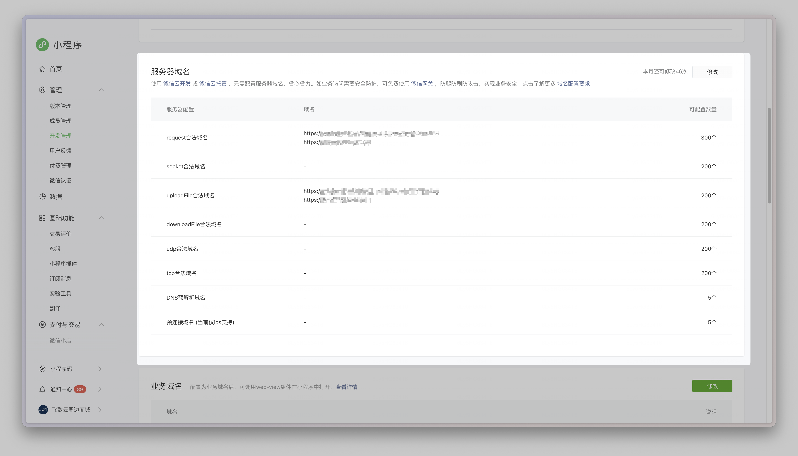
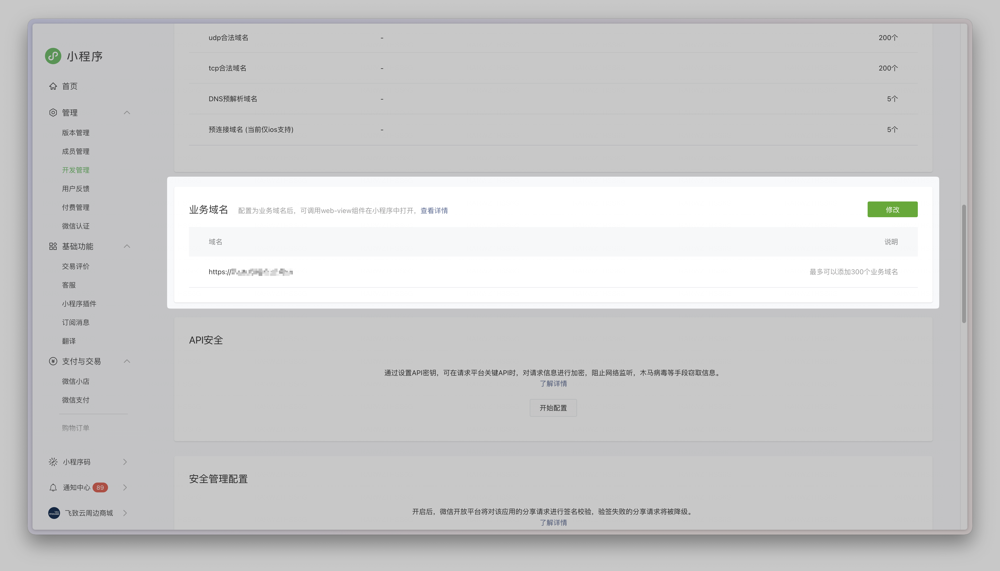
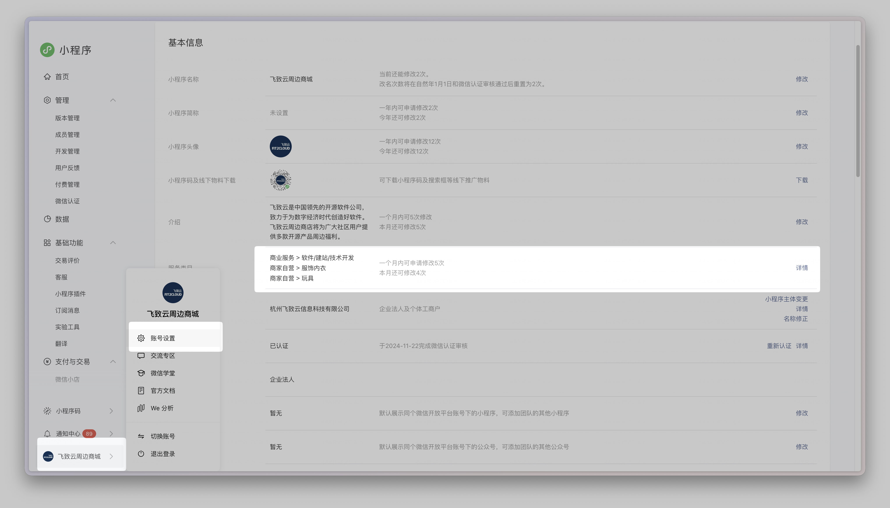
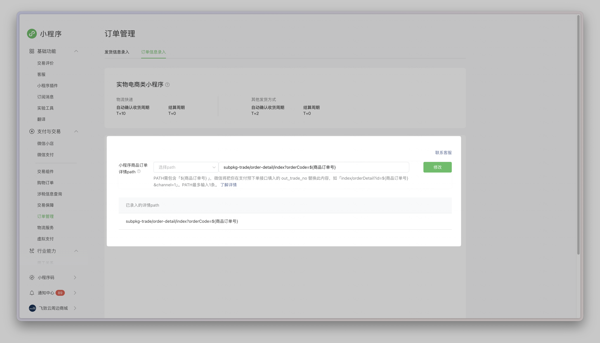
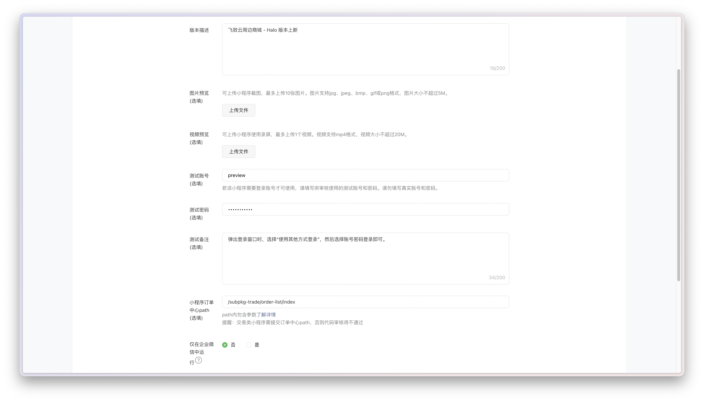

# 上线提审

本文说明在**本地联调完成之后**，正式上传体验版、提交审核或发布上线之前，还需要补齐哪些生产环境与微信公众平台侧的准备工作。

## 适用时机

- 你已经完成本地开发与接口联调。
- 你准备把本地配置切换为**生产环境配置**。
- 你准备上传小程序并至少发布为体验版本。

## 第一步：切换为生产配置

正式构建前，先把所有仍指向本地或测试环境的内容切换掉。

### 1. 修改 `src/config/app.config.local.json`

重点检查以下字段：

- `halo.baseURL`：必须替换为正式 Halo 服务地址，且应为公网可访问的 `https` 域名。
- `business.legalDocuments.*`：如已配置用户协议、隐私政策、支付协议、平台规则、资质证照等链接，需改为正式线上地址。
- `app.name`、`app.logo`、`companyName` 等品牌信息：应与最终上线品牌一致。

> [!IMPORTANT]
> `halo.baseURL` 后续要和微信公众平台里配置的 `request` 合法域名严格对应。

### 2. 检查 `.env`

请确认 `VITE_MOCK_ENABLED` 的值为 false：

```env
VITE_MOCK_ENABLED=false
```

如果这里仍然是 `true`，生产构建后仍可能继续走 Mock 数据。

### 3. 检查 `src/manifest.json`

请确认至少以下内容已经改成正式值：

- `name`
- `description`
- `versionName`
- `versionCode`
- `mp-weixin.appid`
- `mp-weixin.setting.urlCheck` 已设置为 `true`

其中 `mp-weixin.appid` 必须替换为你自己的小程序 AppID，并且要和微信公众平台中的小程序主体一致。

## 第二步：执行生产构建

在配置并检查完第一步的生产配置后，再执行构建，以微信小程序为例：

```bash
pnpm build:mp-weixin
```

微信小程序生产构建产物目录通常为：

```text
dist/build/mp-weixin
```

> [!IMPORTANT]
> 每次修改 `app.config.local.json`、`.env`、`manifest.json` 后，都应重新执行一次构建，避免上传的仍是旧产物。

## 第三步：配置微信公众平台域名

登录 [微信公众平台](https://mp.weixin.qq.com)，前往 **开发管理 → 开发设置**，完成域名相关配置。

### 1. 服务器域名

服务器域名必须为 **HTTPS / WSS**，并且域名需完成 **ICP 备案**。

请按下面方式核对服务器域名：

| 类型         | 对应关系                                                    | 配置建议                                                                 |
| ------------ | ----------------------------------------------------------- | ------------------------------------------------------------------------ |
| `request`    | 对应 `src/config/app.config.local.json` 中的 `halo.baseURL` | 必须配置为 `halo.baseURL` 的域名；同时应与 Halo 后台的外部访问地址一致。 |
| `uploadFile` | 使用 `uni.uploadFile` 上传用户头像                          | 与 `request` 使用同一域名                                                |



### 2. 业务域名（`web-view`）

当在 `app.config.local.json` 中配置了 `business.legalDocuments` 这些线上协议地址，就应同步配置其对应的**业务域名**。

微信官方当前规则要点：

- 业务域名必须是 `https`。
- 域名必须完成 ICP 备案。
- 新备案域名通常需等待一段时间后才能配置，官方文档目前写的是**新备案域名需 24 小时后才可配置**。
- 配置业务域名时，需要按公众平台要求部署**校验文件**并完成校验。



## 第四步：检查类目、资质与隐私合规

这一步是很多团队最容易遗漏、也最容易在提审时被卡住的部分。

### 1. 检查服务类目

由于当前小程序是自营类小程序，因此以微信小程序为例，你需要配置 `商家自营` 类目下的次级类目。



### 2. 检查基础资料

请同步检查以下内容是否和资质、品牌、页面功能一致：

- 小程序名称
- 小程序简介
- 头像

- 主体信息

## 第五步：交易类小程序专项检查

### 1. 配置订单详情 path

微信小程序要求交易类小程序为“小程序购物订单”配置一个**订单详情路径**，用于用户从微信侧订单入口跳回你的小程序订单详情页。

当前配置为

```text
subpkg-trade/order-detail/index?orderCode=${商品订单号}
```



## 提审前总清单

- `halo.baseURL` 已切换到正式环境。
- `VITE_MOCK_ENABLED=false`。
- `mp-weixin.appid` 已替换为正式 AppID。
- ``mp-weixin.setting.urlCheck` 已设置为 `true`
- `pnpm build:mp-weixin` 已重新执行。
- `request` / `uploadFile` / 业务域名已按需配置。
- 服务类目、资质、隐私保护指引已完成。
- 交易类小程序已配置订单详情 path。
- 订单管理、支付、物流链路已在真机验证通过。

## 提交审核

以微信小程序为例，提交审核时，需要提交如下内容：

| 配置项                 | 说明                                                                                          | 推荐配置                                               |
| ---------------------- | --------------------------------------------------------------------------------------------- | ------------------------------------------------------ |
| `版本描述`             | 当前小程序的版本描述                                                                          | 无                                                     |
| `测试账号`             | 用于提供给审核员进行审核的测试账号，建议添加。                                                | 前往 Halo 后台，创建一个新的访客用户即可。             |
| `测试密码`             | 用于提供给审核员进行审核的测试密码，建议添加。                                                | 前往 Halo 后台，创建一个新的访客用户即可。             |
| `小程序订单中心 path`  | 交易类小程序必须填写                                                                          | 未二次开发时为固定值，`/subpkg-trade/order-list/index` |
| `用户隐私保护指引设置` | 小程序是否采集了用户信息。由于当前小程序会采集用户的头像、昵称，因此需要勾选 `采集用户隐私`。 | 勾选 `采集用户隐私`                                    |



至此，微信小程序从「本地开发联调」开始，完成后台数据配置，最后进入「上线提审」完成提审与正式发布的整体步骤已经完成。
