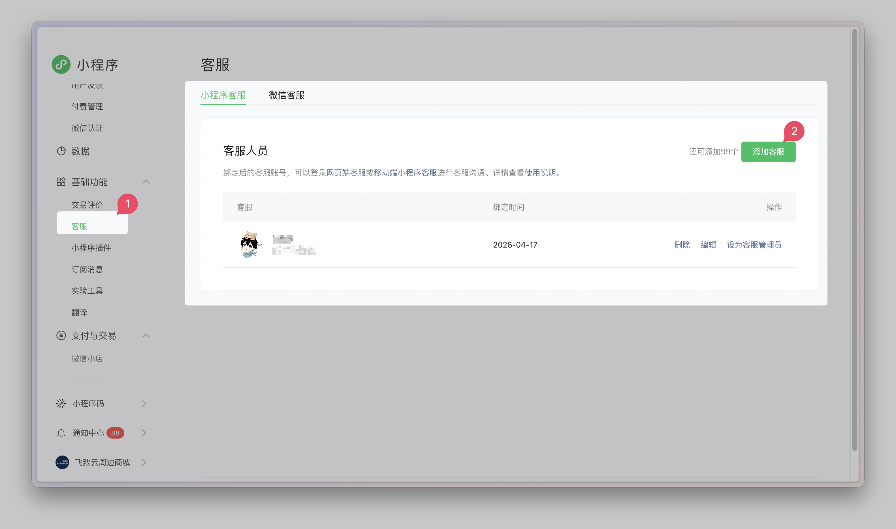
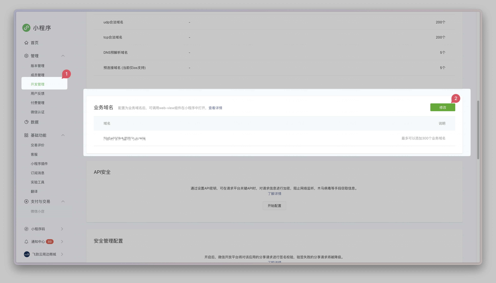

# 项目配置

本文说明如何通过配置文件将小程序适配为你的品牌与接口地址，并与 Halo 后台对齐。

## 配置文件一览

| 文件                               | 作用                                                                                                           |
| ---------------------------------- | -------------------------------------------------------------------------------------------------------------- |
| `src/config/app.config.json`       | **基础配置**，随仓库提交，作为团队默认值，通常不建议直接修改此文件。**请勿将含敏感信息的该文件提交到公开仓库** |
| `src/config/app.config.local.json` | **本地/环境覆盖**，与基础配置深度合并；                                                                        |
| `.env`（根目录）                   | Vite 环境变量，如 `VITE_MOCK_ENABLED`、`VITE_MOCK_DELAY`                                                       |
| `src/pages.json`                   | uni-app 页面路由、TabBar、分包、预加载等                                                                       |
| `src/manifest.json`                | 应用名称、版本号、各端 AppID 等                                                                                |

> [!IMPORTANT]
> 配置在**构建时**被打包进产物，修改配置后需重新执行 `pnpm dev:*` 或 `pnpm build:*` 才能生效。

## `app.config.local.json` — 基础配置

该配置文件为小程序基础配置，其配置会直接体现在小程序内部，包含接口信息、商城基础信息、登录方式配置、业务信息配置、国际化配置等。

`app.config.local.json` 中的设置，将覆盖 `app.config.json` 中的默认配置，因此请务必覆盖想修改的配置，如果不填写，则会使用默认配置。

### 最小可运行示例

在 `src/config/app.config.local.json` 中填写以下内容即可启动（请替换为你的实际域名与文案）：

```json
{
  "app": {
    "name": "你的商城名称",
    "logo": "/static/logo.png"
  },
  "halo": {
    "baseURL": "https://your-halo.example.com"
  },
  "auth": {
    "loginMethods": {
      "primary": "phoneQuick",
      "supported": ["haloAccount"]
    }
  }
}
```

### 配置项详解

#### `app` — 应用基本信息

| 字段                 | 说明                                                                       |
| -------------------- | -------------------------------------------------------------------------- |
| `name`               | 商城名称，展示于`登录页`、`关于我们`等处                                   |
| `nameFontSize`       | 商城名称字号，建议填写 `rpx`，如 `48rpx`， 1px ≈ 2rpx                      |
| `logo`               | Logo 地址，可为本地路径（`/static/...`）或完整 URL，通常展示在商城名称上方 |
| `logoWidth`          | Logo 显示宽度，建议填写 `rpx`，如 `160rpx`                                 |
| `brandDescription`   | 品牌介绍文案，展示于`关于我们`处                                           |
| `companyName`        | 公司名称，展示于`关于我们`底部单独展示的一行公司名称。                     |
| `copyrightOwner`     | 版权所有者                                                                 |
| `copyrightStartYear` | 版权起始年份                                                               |

> [!TIP]
> 当你的品牌 Logo 比较扁、比较高，或左右留白较多时，优先通过 `app.logoWidth` 调整显示宽度；如果应用名称过长或品牌字重较强，可通过 `app.nameFontSize` 微调标题大小，而不必改代码。

#### `halo` — Halo 服务连接

| 字段      | 说明                                                                    |
| --------- | ----------------------------------------------------------------------- |
| `baseURL` | Halo 服务根地址，在生产环境中，需与小程序 request 合法域名一致（HTTPS） |
| `timeout` | 请求超时时间（毫秒），默认 `10000`                                      |

#### `i18n` — 国际化

| 字段            | 说明                              |
| --------------- | --------------------------------- |
| `defaultLocale` | 默认语言，可选 `zh-CN` 或 `en-US` |

#### `auth` — 登录配置

##### `auth.loginMethods`

| 字段        | 说明                         |
| ----------- | ---------------------------- |
| `primary`   | 默认展示的登录方式           |
| `supported` | 用户可切换的其他登录方式列表 |

**当前支持的登录方式：**

| 值            | 说明                                         |
| ------------- | -------------------------------------------- |
| `phoneQuick`  | **手机号一键登录**，此功能拥有自动注册功能。 |
| `haloAccount` | Halo 账号密码登录                            |

> [!NOTE]
> 开启 `phoneQuick` 即手机号一键登录后，同时也会启用新用户手机号自动注册的功能，因此请务必在 Halo 后台中，启用开放注册功能，详见 [3.prepare-backend.md](./3.prepare-backend.md)。

#### `business` — 业务配置

| 字段                    | 说明                                                                                                     |
| ----------------------- | -------------------------------------------------------------------------------------------------------- |
| `currencySymbol`        | 价格货币符号，默认 `¥`                                                                                   |
| `maxCartItems`          | 单商品购物车数量上限                                                                                     |
| `contactServiceEnabled` | 是否展示联系客服入口，开启此功能后，需要前往小程序客服中，设置客服人员。（此功能暂时只有微信小程序支持） |
| `legalDocuments`        | 协议与法务链接（见下方说明）                                                                             |
| `helpCenterFaqs`        | 帮助中心 FAQ 问答列表                                                                                    |

##### `business.contactServiceEnabled`

用于控制页面中是否展示“联系客服”入口。当开启此功能后，需要前往 `微信小程序后台 - 基础功能 - 客服 - 小程序客服` 中，设置对应的客服人员。

设置后，用户通过 “联系客服” 功能，可直接通过微信与客服联系，无需进行第三方对接。



`business.legalDocuments`

| 字段               | 说明                 |
| ------------------ | -------------------- |
| `userAgreement`    | 用户协议链接（可选） |
| `privacyPolicy`    | 隐私政策链接（可选） |
| `paymentAgreement` | 支付说明链接（可选） |
| `platformRules`    | 平台规则链接（可选） |
| `qualification`    | 经营资质链接（可选） |

> [!TIP]
> 上线前，所有法务链接建议均为 **HTTPS** 可访问地址，此地址还需在微信公众平台配置对应**业务域名**。



##### `business.helpCenterFaqs`

用于配置帮助中心中的常见问题与答案内容，适合补充配送、售后、支付说明等固定文案。

## Mock 与环境变量

根目录 `.env` 文件示例：

```env
VITE_MOCK_ENABLED=false
VITE_MOCK_DELAY=400
```

| 变量                | 说明                                                         |
| ------------------- | ------------------------------------------------------------ |
| `VITE_MOCK_ENABLED` | 设为 `true` 时，请求走 Mock，不依赖真实 Halo，适合纯前端演示 |
| `VITE_MOCK_DELAY`   | Mock 响应延迟（毫秒），用于模拟网络延迟                      |

如需区分多个环境，可扩展为 `.env.development`、`.env.production`（需与 Vite 约定一致）。

## `pages.json` — 页面路由与导航配置

当你需要新增页面、调整首页、修改底部导航、拆分分包，或控制页面标题与下拉刷新时，可以修改当前内容。

> [!warning]
>
> 如非开发需求，通常不太建议修改 `pages.json`。

### 常见修改项

此处仅列出一些常见的配置项，详细配置请参阅 <https://uniapp.dcloud.net.cn/collocation/pages>

| 场景         | 常改位置                        | 说明                                 |
| ------------ | ------------------------------- | ------------------------------------ |
| 新增页面     | `pages` / `subPackages[].pages` | 页面文件创建后，必须在这里注册       |
| 修改页面标题 | `style.navigationBarTitleText`  | 控制原生导航栏标题文字               |
| 拆分分包     | `subPackages`                   | 将低频页面拆到分包，减少主包体积     |
| 配置预加载   | `preloadRule`                   | 预加载某些分包，优化进入后续页面速度 |

## `manifest.json` — 应用信息与平台配置

当你需要填写小程序 AppID、修改应用名称、更新版本号、声明平台权限，或调整特定平台能力时，可修改此配置文件。

> [!warning]
>
> 通常只需要修改一些小程序信息相关的基础配置项，权限配置等已默认配置完成。

### 常见修改项

| 字段          | 说明                   |
| ------------- | ---------------------- |
| `name`        | 应用名称               |
| `description` | 应用描述               |
| `versionName` | 版本名称，例如 `1.0.0` |
| `versionCode` | 版本号，通常为递增数字 |

### `微信小程序配置`

| 字段                             | 说明                                                       |
| -------------------------------- | ---------------------------------------------------------- |
| `mp-weixin.appid`                | 微信小程序 AppID，发布前必须替换为你自己的                 |
| `mp-weixin.setting.urlCheck`     | 开发阶段可用于关闭合法域名校验，正式发布前应按平台要求检查 |
| `mp-weixin.requiredPrivateInfos` | 需要声明使用的微信私有接口能力                             |

> [!IMPORTANT]
> `mp-weixin.appid` 需与微信公众平台中的小程序主体保持一致，否则真机预览、上传、发布流程会受影响。

有关 `manifest.json` 的详细配置文件，请参阅 [manifest.json 应用配置](https://uniapp.dcloud.net.cn/collocation/manifest.html#manifest-json-%E5%BA%94%E7%94%A8%E9%85%8D%E7%BD%AE)。
